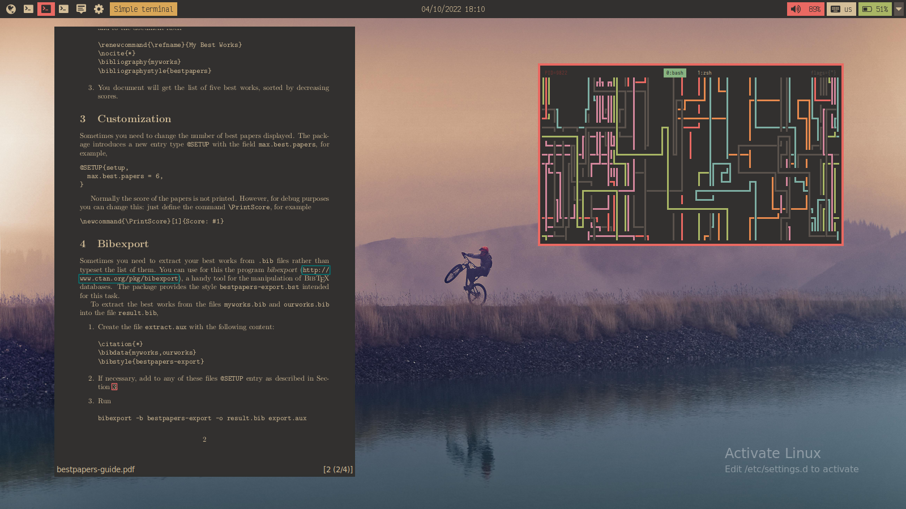
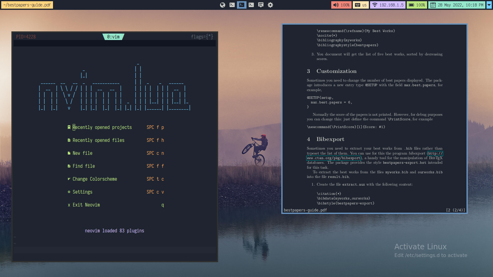
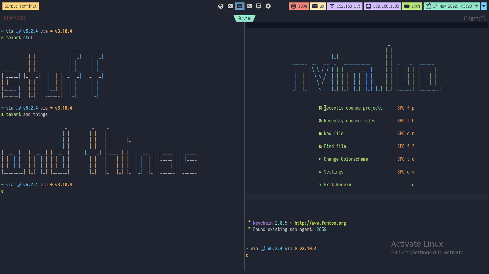
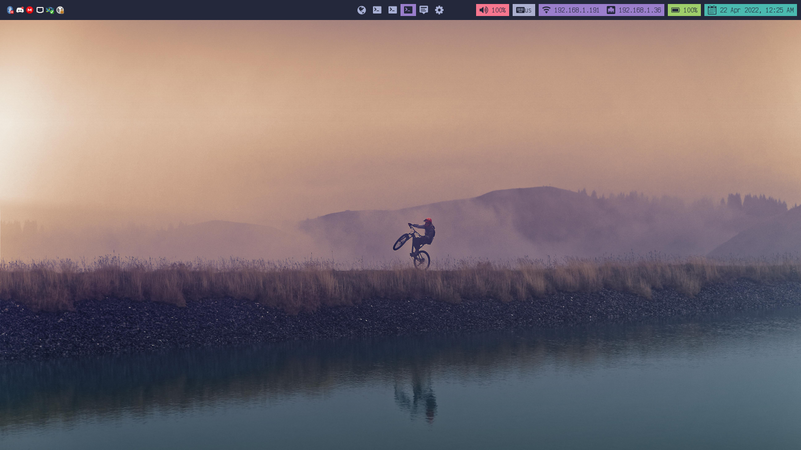
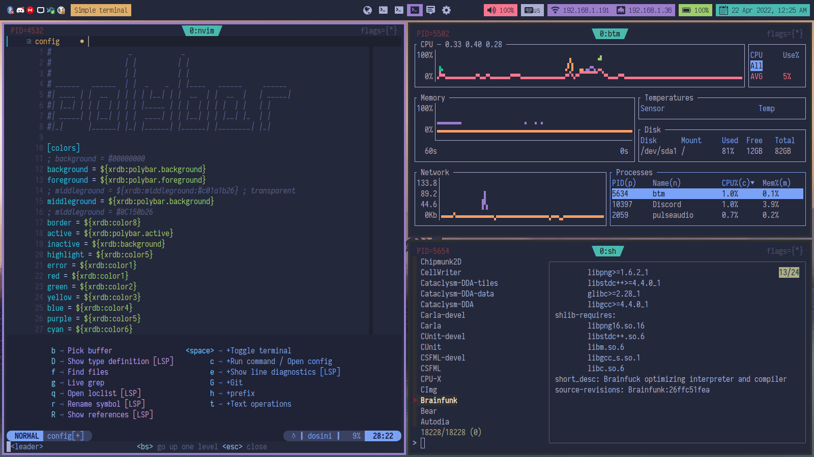
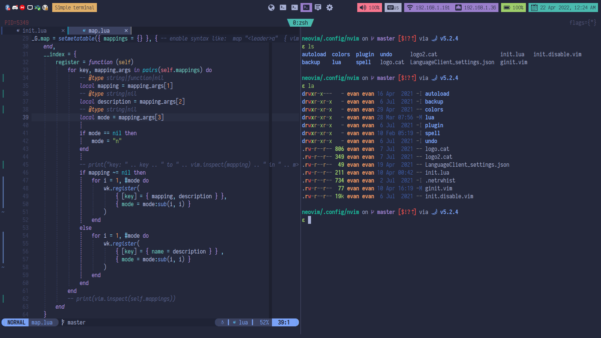
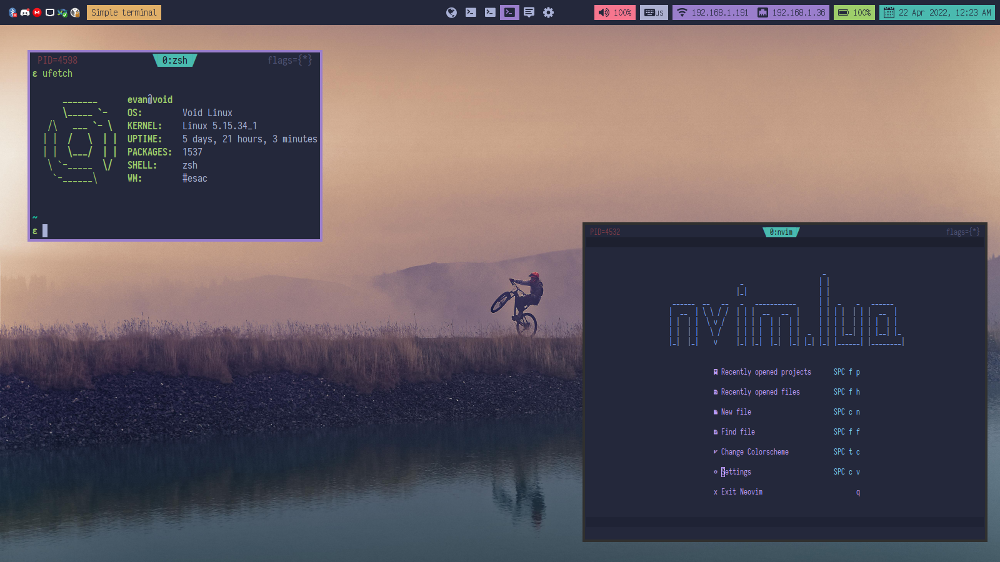
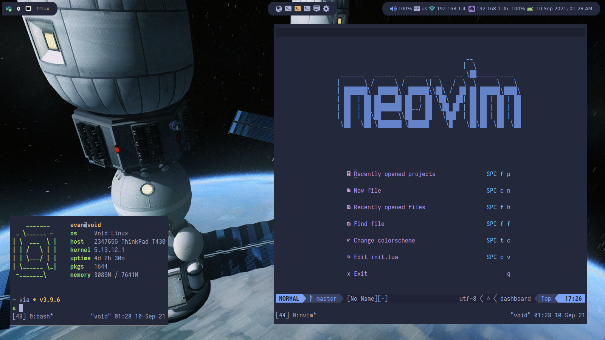
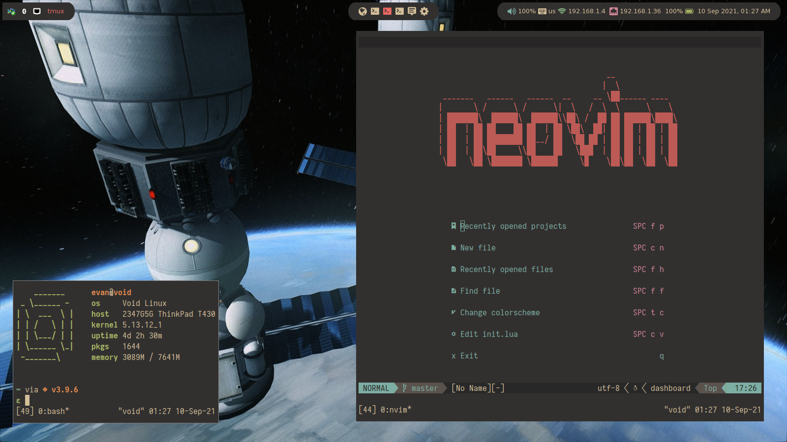

My dotfiles, use at your own risk.

# usage

```
git clone http://github.com/cultab/dotfiles
cd dotfiles
stow <config-for-program>
```

# screenshots

some might be out of date





















